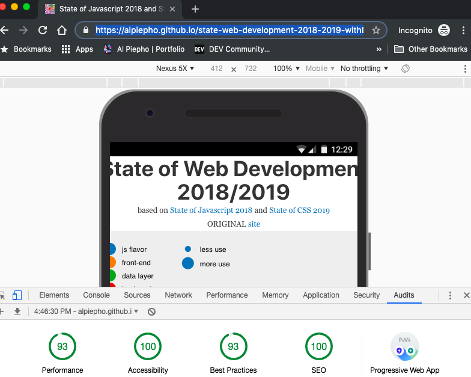

# State of Web Development Force Graph Diagram - PWA Version

This is a D3 force graph diagram based on the data from the [State of Javascript 2018](https://2018.stateofjs.com) and [State of CSS 2019](https://2019.stateofcss.com) Survey results.  

The D3 design is based on a project from Nau Technologies that can be found [here](https://naustud.io/tech-stack/) and [GitHub](https://github.com/trongthanh/techstack).  

This PWA site adds some changes to how the data is declared, Google Analytics tracking, and the use of LocalStorage to save the state after dragging the bubble around.

This is deployed on gh-pages [here](https://alpiepho.github.io/state-web-development-2018-2019-withD3-pwa/)

## Controlling Local Storage

Added save/restore of locations to local storage, so they are preserved for a local user.  To clear this, either use the Chrome Dev tools ('Application' section) or change
the number of bubbles by displaying in smaller screen size.

## Lighthouse Audit for PWA

Using React and particularly Gatsby makes it easy to score well with the Google Lighthouse Audit. Below is a test for this PWA:

## Remaining Work

After finishing the port to a PWA, there are few things to finish:

- fix image paths in the data.js (hard coded with github project path for now)
- use GraphGL method to get data.js details
- fix some of the small form factor widths etc.
